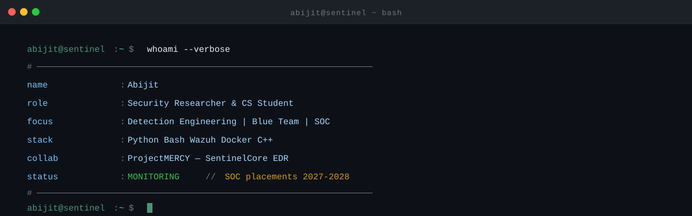

  

  <i>How do you know something bad is happening — and how do you prove it wasn't just noise?</i>

  
  
  

---

### About

Third-year CS student working the defensive side of security — detection engineering, SIEM operations, and endpoint telemetry.

I build small systems that force me to learn how detection actually works underneath the dashboard: what counts as a signal, when it's allowed to fire, and why most of them shouldn't. Several of the projects below are independent attempts at the same hard problem — separating real attacker behaviour from the enormous amount of ordinary software that merely looks suspicious.

Outside of that: CTFs, a Wazuh home lab, and running a security study jam for students at my college who have never touched this before.

### How I think about detection

Rules I keep arriving at independently, across unrelated projects:

- **Capability is not intent.** Plenty of trusted software installs keyboard hooks, opens raw sockets, reads the clipboard. Flagging capability alone is how you build a tool analysts learn to ignore.
- **Persistence amplifies risk, it doesn't create it.** A single observation is a data point. Behaviour that survives over time is a signal.
- **Every signal has to explain itself.** If I can't say *why* something scored what it scored, nobody can triage it. So a model score never crosses a threshold on its own — it only amplifies a rule that already fired.
- **Correlation beats volume.** One high-confidence incident assembled from a complete attack chain is worth more than a thousand isolated alerts.

---

### Selected work

**[keyboard-hook-behavioral-detector](https://github.com/abijit2626/keyboard-hook-behavioral-detector)** · `Python` `Windows` `scikit-learn`

A behavioural monitor that finds processes *capable* of keylogging and scores how suspicious they look over time. It never hooks the keyboard, captures keystrokes, or injects code — it's the detector, not the thing being detected.

Three independent signal layers, deliberately gated so none of them can escalate a process alone:

- a rule engine tracking hook capability with temporal persistence and risk decay
- a RandomForest trained on ClaMP — 5,210 real labelled Windows executables, 67 PE-header features
- a static import-table fingerprint mapping ten API categories to current MITRE ATT&CK techniques (T1056.001, T1113, T1115, T1547.001, T1622, T1497)

Machine learning output can only amplify a rule-based trigger, never create one — an allowlisted process scores zero no matter what the model says. Ships a terminal risk table and a read-only Flask dashboard, bound to localhost by default because the telemetry is itself sensitive.

**[SIEM-Project — Attack Chain SIEM](https://github.com/abijit2626/SIEM-Project)** · `Python` (standard library only)

A stateful correlation engine that raises an incident only when a full attack chain appears in the right order, inside a time window: access anomaly → C2 beacon → objective behaviour.

C2 beacons are found by interval-variance analysis rather than ML, so every flag can be walked through by hand. Per-entity state tracks stage progression and chains expire when the window lapses. The test suite asserts the *negative* cases as hard as the positive ones — a beacon alone produces nothing, access plus objective without a beacon produces nothing. That restraint is the entire point.

**[personal-recon-tool — Ghost](https://github.com/abijit2626/personal-recon-tool)** · `Bash`

A modular recon framework for CTFs, HTB, and authorised engagements. One entry point, ten pipeline stages — port scan, web fingerprinting, per-service enumeration, DNS recon, content discovery, SSL/TLS, screenshots, vuln scripts — ending in a self-contained HTML report.

Most of the engineering is in the failure modes: every external tool is probed before use and skipped silently when missing, every command runs under a timeout so one hung scanner can't stall the run, and output directories auto-increment so nothing is ever overwritten or blocks on a prompt mid-scan. Dedicated enumeration modules for FTP, SSH, RPC, SNMP, SMB, MySQL, Redis, and MongoDB.

**[wazuh-investigations](https://github.com/abijit2626/wazuh-investigations)** · `Python` `Wazuh` `Sysmon`

A SOC home lab with both sides of the fight in one repo.

`simulation/` is a stateful adversary telemetry generator, not a random log spammer. It tracks which users and hosts are already compromised and emits chronologically coherent, MITRE-mapped events — T1110.001 brute force leading into T1003.001 LSASS dumping — as ndjson written straight into Wazuh ingestion.

`investigations/` is what I found when I pointed Wazuh at it: alert triage, false-positive root cause analysis, and the detections that *didn't* fire — scheduled task creation, suspicious PowerShell, plaintext credentials on the command line — each written up with its root cause, its impact, and the rule needed to close it.

**[ctf-workshop](https://github.com/abijit2626/ctf-workshop)** · `Python` `Flask` `Docker`

An 18-challenge, one-day CTF I built and run for the TinkerHub study jam, aimed at college students with no security background at all.

Three rounds — network recon, web exploitation, steganography — running fully offline on an isolated lab network, Dockerised behind a single `./event.sh up`. Every challenge carries two to three progressive hints, because the design goal is that beginners work it out themselves instead of asking an organiser for the answer.

It self-tests: 38 automated checks validate all 18 flags at startup, and it refuses to print "ready" if any of them fail. Nobody wants to discover a broken challenge with forty people already in the room.

**[hackerone-ctf-writeups](https://github.com/abijit2626/hackerone-ctf-writeups)**

Solved-and-explained writeups from Hacker101 — Micro-CMS v1 and v2, A Little Something to Get You Started, and Encrypted Pastebin. The padding oracle work from that last one fed straight back into the study jam above, which now runs a live instructor demo of the attack.

**[ProjectMERCY — SentinelCore EDR](https://github.com/Tushar27-git/ProjectMERCY)** · co-developer with [Tushar](https://github.com/Tushar27-git)

A Windows EDR built around a kernel minifilter driver, using WDM callbacks for real-time process, thread, image-load, and handle-access telemetry — plus a user-mode agent, an AMSI provider, and an ML-based threat detection pipeline. The kernel-level counterpart to the user-mode telemetry work above.

`C++` `C` `Python` `Windows Kernel` `EDR` `AMSI`

---

### Tech

| Area | Tools |
|---|---|
| Languages | Python, Bash, C++, Java |
| Detection & SIEM | Wazuh, Sysmon, MITRE ATT&CK, detection gap analysis, correlation engines |
| Windows & endpoint | PE format analysis, import-table fingerprinting, Windows internals, process telemetry |
| Offensive, for defensive ends | nmap, Burp, service enumeration, web exploitation, steganography |
| Build & infra | Docker, Flask, scikit-learn, SQLite, Git |

### Currently

- Extending the Wazuh lab into a **detection-as-code pipeline** — Sigma rules, Atomic Red Team simulation, and CI-validated pass/fail instead of re-checking every rule by hand
- Investigating whether today's endpoint telemetry can actually distinguish **autonomous AI agent activity** from human-driven attacks or conventional malware
- Running the TinkerHub security study jam

### Looking for

- SOC analyst and detection engineering roles through final-year placements (**2027–2028**)
- Open source security projects to contribute to
- Anyone working on detection engineering, SIEM tuning, or endpoint telemetry who wants a second pair of eyes

---

  

